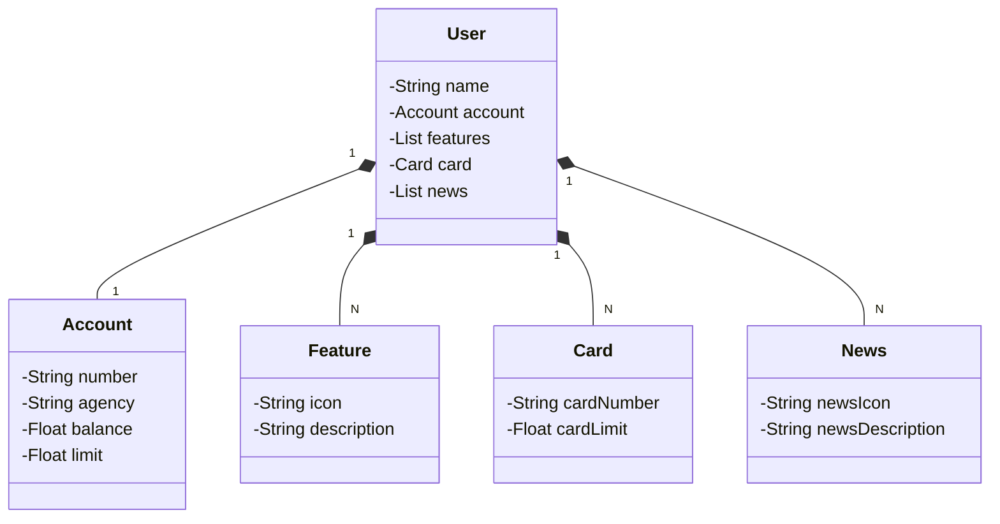

# Santander Dev BootCamp Java + Angular - 2023
Java RESTful API criada para o bootcamp santander 2023

## Diagrama de Classes

```mermaid
classDiagram
  class User {
    -String name
    -Account account
    -List<Feature> features
    -Card card
    -List<News> news
  }

  class Account {
    -String number
    -String agency
    -Float balance
    -Float limit
  }

  class Feature {
    -String icon
    -String description
  }

  class Card {
    -String cardNumber
    -Float cardLimit
  }

  class News {
    -String newsIcon
    -String newsDescription
  }

  User "1" *-- "1" Account
  User "1" *-- "N" Feature
  User "1" *-- "N" Card
  User "1" *-- "N" News
```
